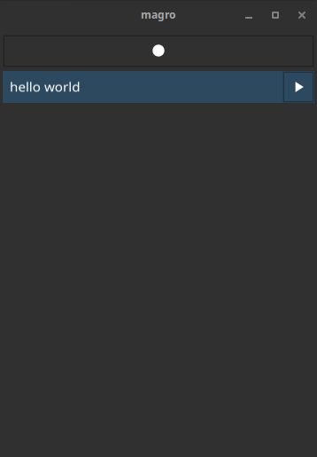
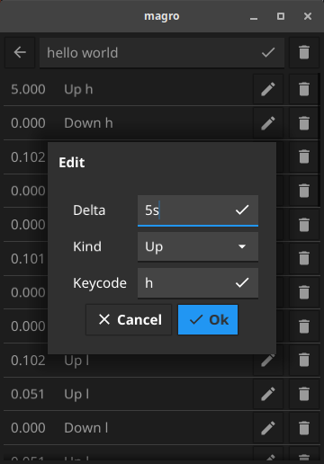

# magro

A keyboard macro tool built
using [robotgo](https://github.com/go-vgo/robotgo), [gohook](https://github.com/robotn/gohook),
and [fyne](https://fyne.io/). Refer to the documentation of gohook and fyne to learn how to learn build for your system.

Create macros with the simple to use macro recorder! Press the *record* button and that's it!

If the macro isn't exactly the way you like it, simple edit the individual events.
Allows fine-tuning the deltas, changing the stroke type, or even just the key pressed.

.

# features

I would like to keep the scope pretty small so this doesn't become too bloated. That being said, there are a few things
I do intend on adding in the future.

List of completed and future features:

- [X] Recording macros
- [X] Deleting macros and events
- [X] Seamless persistence
- [X] Editing events fields
- [ ] Fine-grained event editing and creation
- [ ] Modifier key support
